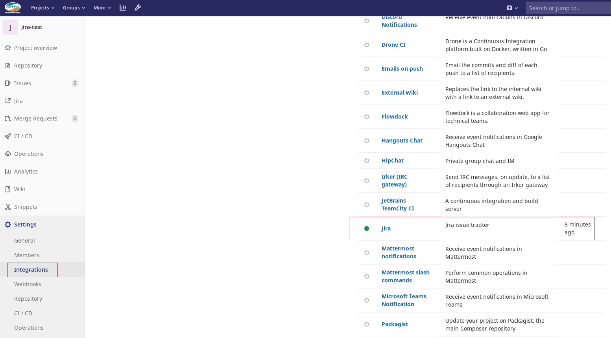
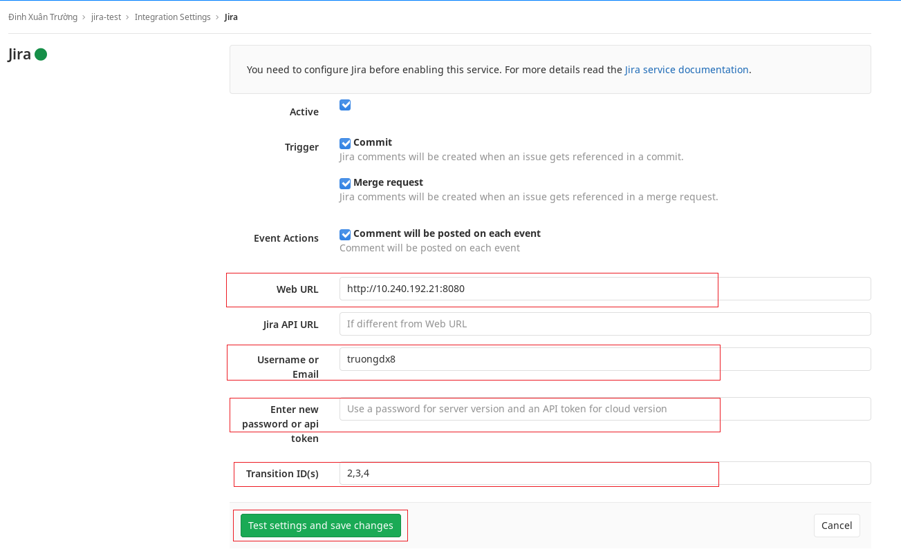
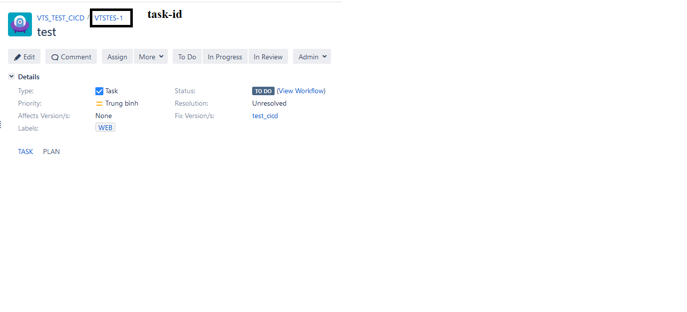
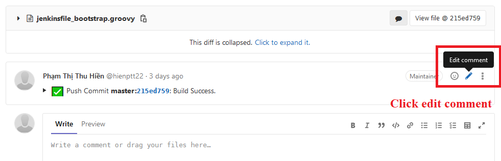
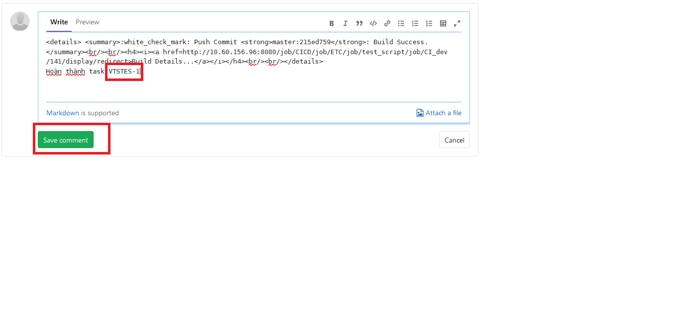
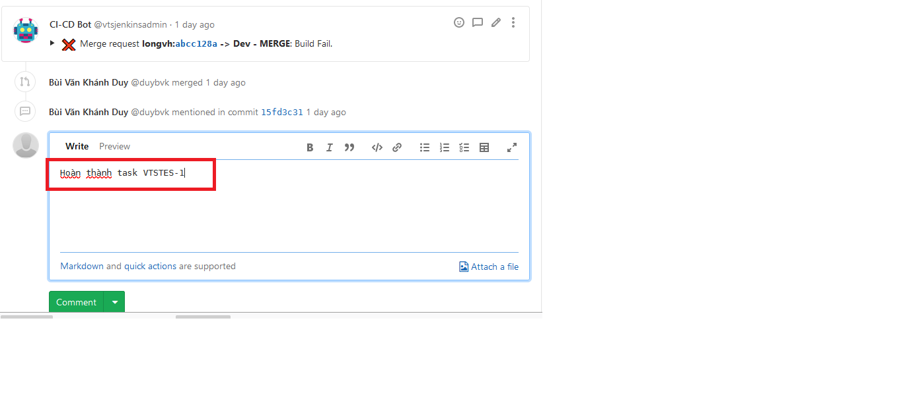
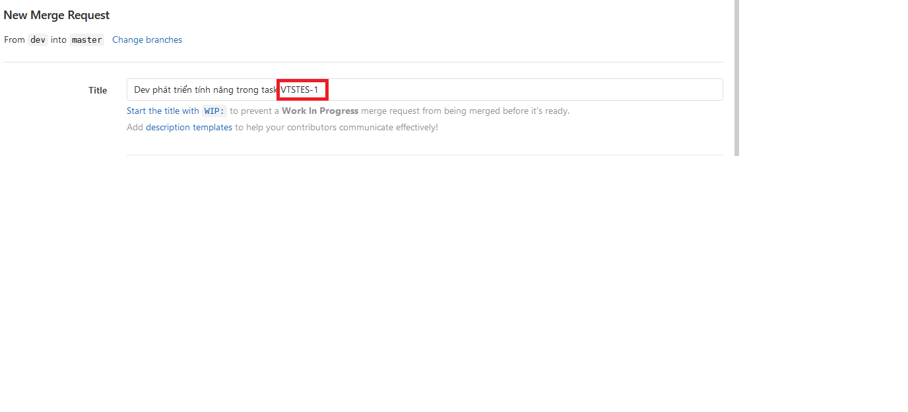
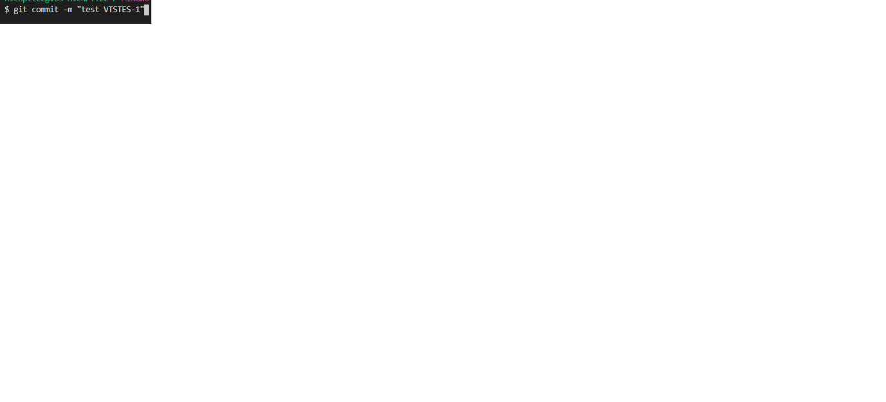
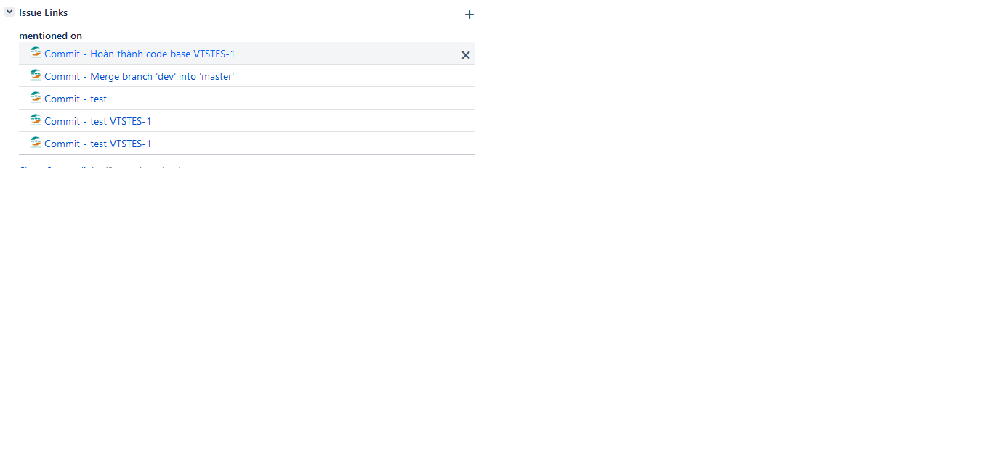
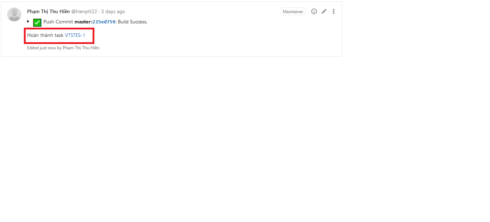

# Hướng dẫn kết nối project git và Jira nội bộ.

# Enable plugin Jira của project

Truy cập mục `Intergration` ở tab `Settings` của project 

# Nhập các thông tin kết nối tới Jira

| Field | Description |
| -----:|:------------|
| Web Url | http://10.240.192.21:8080 |
| Jira API URL | Bỏ trống |
| Username or Email | Tài khoản Jira (AD) |
| Password/API token | Mật khẩu Jira (AD) |
| Transition ID | 2,3,4 |

Sau đó click `Test settings and save changes `

# Làm việc với các task trên Jira

Lấy thống tin mã task được giao ở Jira 

Sau khi thực hiện việc code, sửa **comment vào commit với message chứa mã task**.

Thực hiện gán task với merge request bằng cách **comment vào merge với message chứa mã task** hoặc 
**sửa title merge request với message chứa mã task**

Sau khi thực hiện việc code, tạo **commit với message chứa mã task**.

Kết quả trên task của Jira chứa mention và refer tới git commit 

Nguồn: https://docs.gitlab.com/ee/user/project/integrations/jira.html